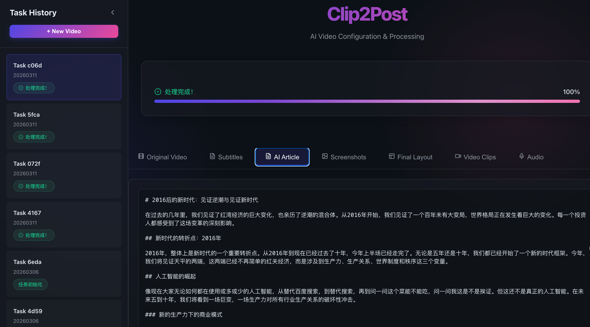
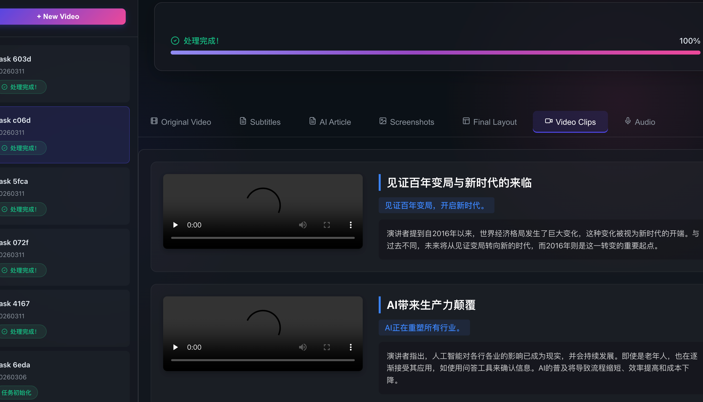

# Clip2Post - 视频转文章与 文字转视频

Clip2Post 是一个全媒体处理工具，旨在实现视频与文章、文字与视频之间的双向全自动转化。

## 🚀 主要功能

- **视频转文章 (Video to Article)**：
  - 自动语音识别 (ASR)：支持 FunASR、Faster-Whisper 等。
  - 智能文案生成：LLM 自动总结视频内容并生成结构化文章。
  - 自动视频截图：根据内容自动抓取关键帧并插入文章。
  - 片段提取：AI 识别精彩片段并自动剪辑。

- **AI 视频复刻 (Text to Video / Agent Mode)**：
  - **文字转视频**：输入文案，自动生成配音并实时渲染动态排版视频。
  - **Agent 模式**：只需提供台词或主题，AI 自动完成脚本撰写、配音生成及图片素材的智能对位。


- **多模式配音 (TTS)**：
  - 集成 Edge-TTS、Kokoro 及 ChatTTS 语音合成矩阵，提供自然流畅的配音效果。

---

## 📸 运行效果






---

## 🛠️ 环境准备

### 依赖安装
1. 确保已安装 **FFmpeg**。
2. 安装 Python 依赖：
```bash
pip install -r requirements.txt
```

### 配置环境
在根目录创建 `.env` 文件，填写 API 密钥等信息：
```env
OPENAI_API_KEY=你的API密钥
OPENAI_BASE_URL=https://api.openai.com/v1
LLM_MODEL=gpt-4-turbo
```

---

## 📖 使用说明

### 1. Web 控制台 (推荐)
```bash
# 启动 API
python main.py

# 启动前端 (另开终端)
cd webui
npm install && npm run dev
```

### 2. 命令行操作
具体可看 cli.py
```bash
# 全流程视频转文章
python cli.py --video ./test.mp4

# 提取片段并添加动态字幕覆盖
python cli.py --video ./test.mp4 --extract-clips --add-text-overlay
```

### 3. 需要安装remotion
```bash
cd skills/remotion

npm install

```

---

## 📂 输出结构
- `audio/`：配音与音轨。
- `ai/`：AI 脚本与配置文件。
- `images/`：提取或上传的素材。
- `videos/`：最终合成的视频。
- `article/`：生成的 HTML 文章。

---
Made with ❤️ by WtecHtec.
